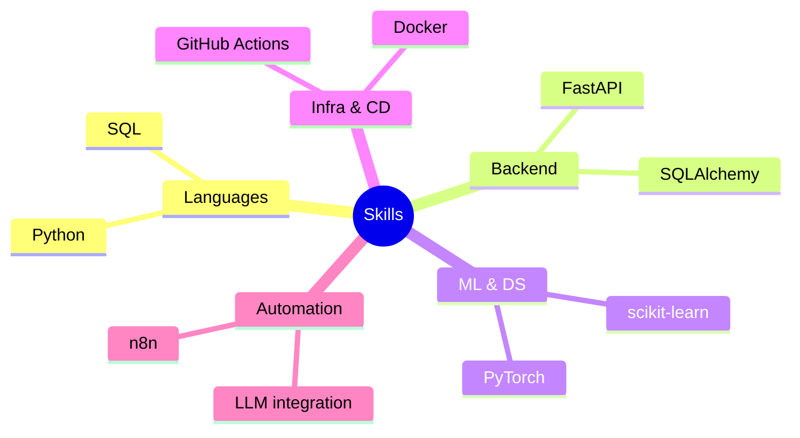

## Привет! Я Антон 
### Backend / Automation / ML-разработчик из Москвы. Студент Московского Авиационного Института (МАИ). 
---

### Мой стек технологий

---

### Полный технический бэкграунд

* **Backend & Инструменты:** FastAPI, Pydantic, SQLAlchemy, Bash-скриптинг, Alembic, управление очередями задач (Celery, Redis).
* **Data Science & ML:** Классическое машинное обучение с scikit-learn, глубокое обучение на PyTorch, работа с данными через Pandas и NumPy.
* **AI & Автоматизация:** Интеграция современных LLM, построение сценариев автоматизации процессов в n8n, работа с векторными базами данных для интеллектуального матчинга.
* **Парсинг & Скрейпинг:** Проектирование сложных и отказоустойчивых парсеров и краулеров (Scrapy, Playwright, Selenium, BeautifulSoup), извлечение структурированных данных из документов (pdfplumber).
* **DevOps:** Контейнеризация приложений через Docker / Docker Compose, оркестрация в Kubernetes, построение пайплайнов автоматического деплоя в GitHub Actions / GitLab CI на удаленные сервера и облачную инфраструктуру.

### 📫 Как со мной связаться
* GitHub: [Antonkak](https://github.com/Antonkak)
* Telegram: [@kartonkaton](https://t.me/kartonkaton)
* Email: anakalashnikov@mai.education

Я когда все сломалось, а до защиты 5 минут

<!--
**Antonkak/Antonkak** is a ✨ _special_ ✨ repository because its `README.md` (this file) appears on your GitHub profile.

Here are some ideas to get you started:

- 🔭 I’m currently working on ...
- 🌱 I’m currently learning ...
- 👯 I’m looking to collaborate on ...
- 🤔 I’m looking for help with ...
- 💬 Ask me about ...
- 📫 How to reach me: ...
- 😄 Pronouns: ...
- ⚡ Fun fact: ...
-->
